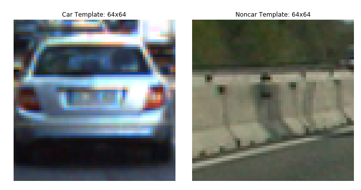
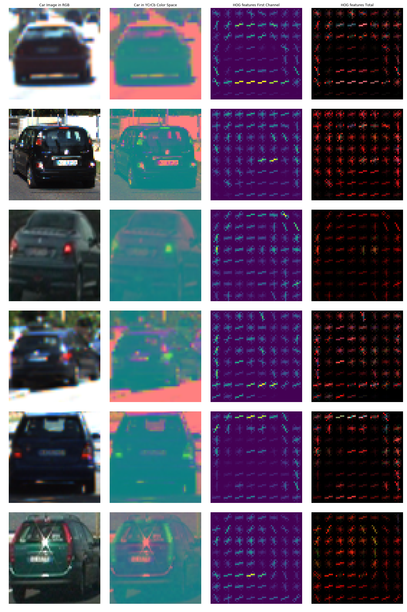
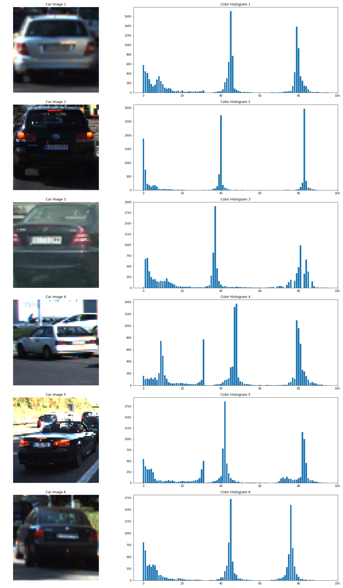
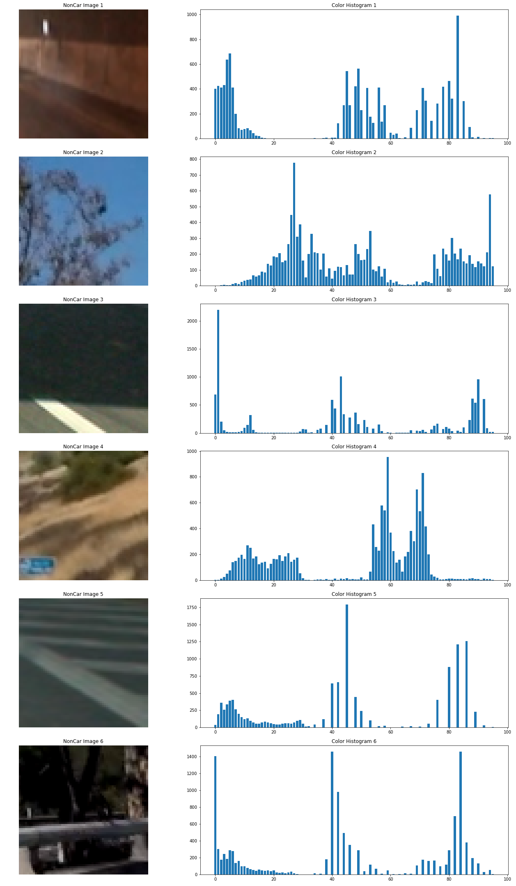
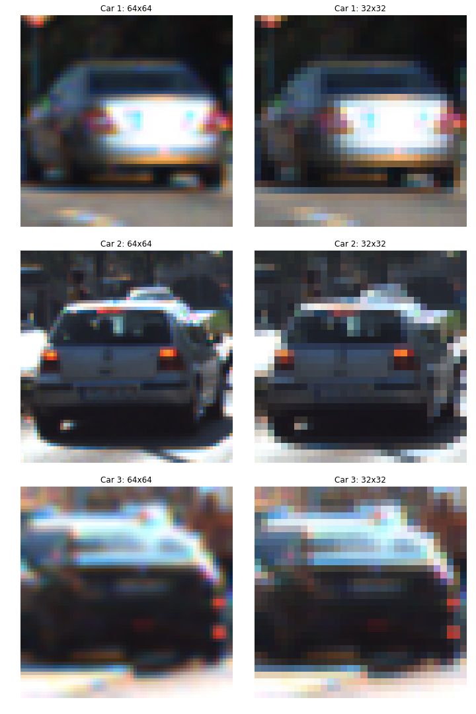
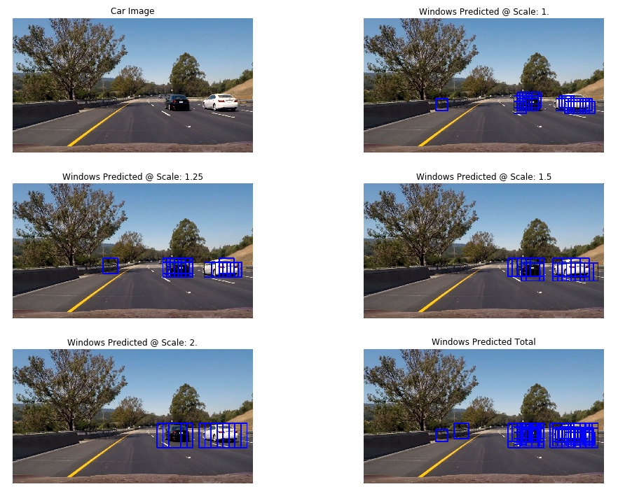
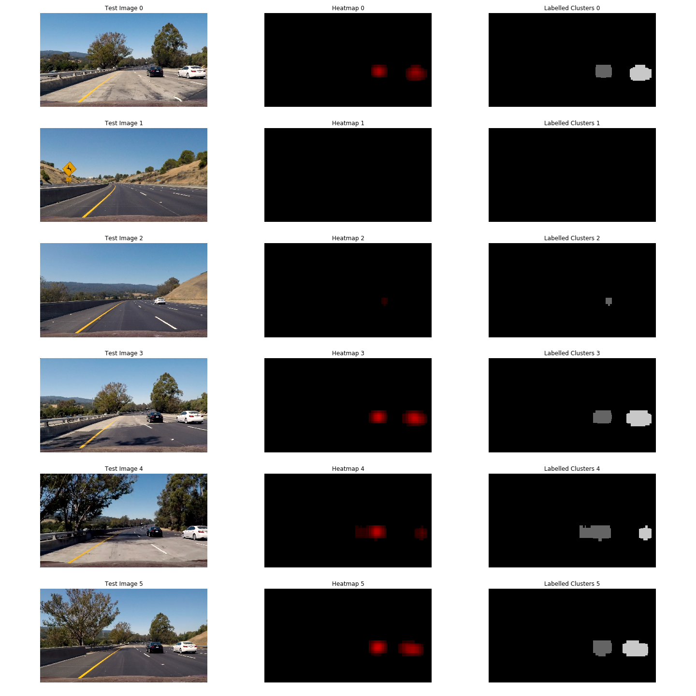
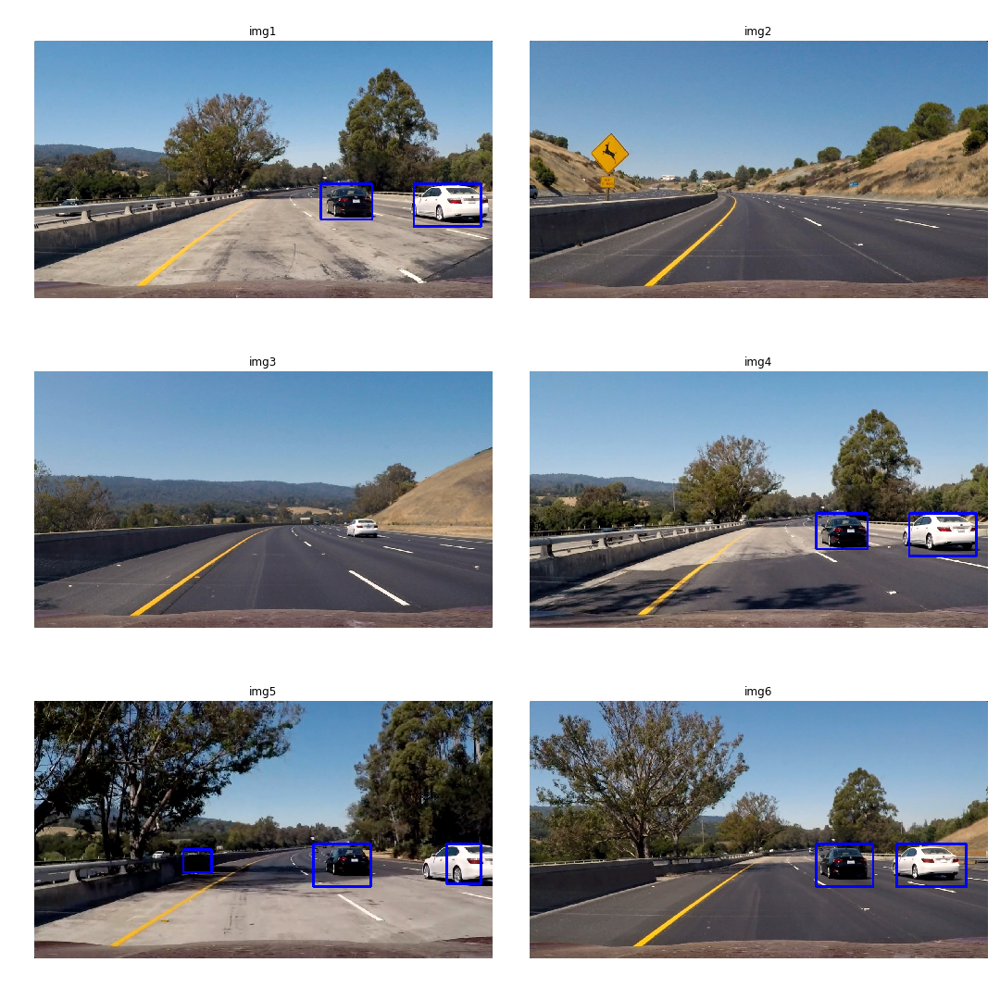
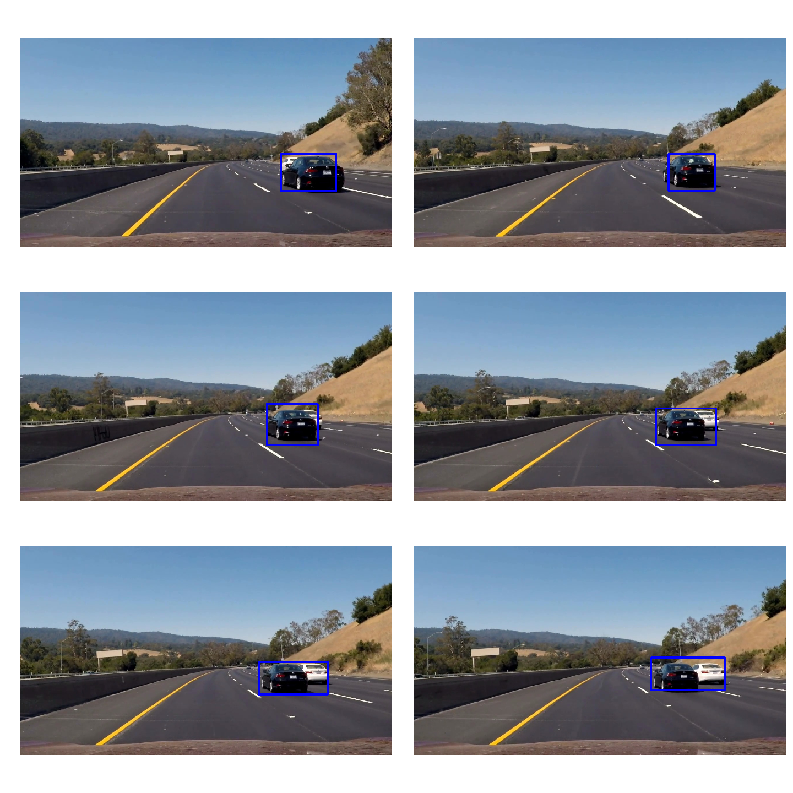

# **Vehicle Detection Project**

### This project's target is to detect and track moving vehicles in a video stream, using computer vision techniques to extract the features within every frame and a classifier to identify cars from noncars.

### The Project is defined into these major steps:
#### 1. Extracting features from the provided data set of 64x64 images of cars and noncars `extract_features()`.
#### 2. Feeding the the dataset's extracted features into a Linear Support Vector Machine Classifier `clf`. 
#### 3. Process every image, using a sliding windows technique to identify and label possible windows' clusters defining vehicles; `process_img()`.
#### 4. Process a video stream, by processing every frame individually and tracking each detected car with a high certainity while ignoring false positives; `process_vid()`

---

## 1. DataSet Feature Extraction: `extract_features()`
The dataset provided is composed of 17,760 images, 64x64 pixels/img, 8,792 car images and 8,968 noncar images. Below is a sample of the car and noncar data:
<p align="center">

</p>

Each image's dimensions is 64x64, which resembles a window in an image. For every image we generate a feature vector containing the following features concatenated. 

### The `extract_features()` function uses the following functions to acquire each image's features and concatenates them in a single feature vector:

### 1. Histogram of Oriented Gradients (HOG) Features: `hog_feature()`
We first perform the Histogram of Oriented Gradients on the 64x64 image, using the `skimage.feature` module we import `hog()` function which performs HOG on a single image channel. We provide the `hog()` function with several parameters:
* The number of orientation bins within which we distribute the gradients: `hog_bins = 9`.
* The number of pixels in each HOG cell, in which we accumulate the computed gradients: `px_pcell=8`.
* The number of HOG cells in each HOG block: `cell_pblock=2`.
* The Channel to perform HOG calculation within or `'ALL'` for all 3 channels combined: `hog_channel='ALL'` 
*The `hog_feature()` function, obtains a feature vector of length: 509,436 features/channel.*

***The histogram of oriented gradients technique proves that its extremely efficient in detecting the external outline of a car, as follows:***

*Note: Although the first color channel extracts almost the entire car, in some random cases the combined HOG features, further defined the car, which could be abstracted from the following figure: *

<p align="center">

</p>

### 2. Colors Histogram: `color_hist()`
Second, we compute the histogram of the colors within the image which is well clustered in the **YCrCb** color space for cars and could be separated with a classifier from noncars. We change the image's color space using OpenCV's function `cv2.cvtColor()`. 

Each image is separated into three separate channels, and the colors of each channel is distributed among `color_bins = 32` in a histogram using Numpy's `np.histogram()`. The histograms of each channel are then concatenated together into a vector of 96 features.

*The `YCrCb` color space was chosen following several experiments and visualizing the scatterplot of car and non car images within different colorspaces.*

Moreover, the color histogram of random car and noncar samples were visualized in the **YCrCb** color space; A pattern reveals its self.

<p align="center">

</p>

Where noncar images, does not show a similar pattern to car data color histograms, specially in the **YCrCb** color space. In contrast, noncars have random different patterns of color histograms.

<p align="center">

</p>


### 3. Spatial Binning: `spatial_bin()`
Third, we want use the car image itself, increasing the number of features in the feature vector. However, including a 64x64 image would create a massive addition to the other features. Therefore, we resize the image to the specified size `spatial_size=(32,32)` to 32x32 pixels using OpenCV's `cv2.resize()`. Moreover, the resized image is unraveled, into a single vector of length 3,072.

*The images when resized from 64x64 to 32x32 approximately doesn't lose any features; as shown below:* 
<p align="center">

</p>

### Now our data features are extracted and are ready to be classified into Cars and NonCars.

---

## 2. Normalizing and Classifying Dataset:
After we extracted the cars and noncars features, we are required to perform these following major tasks discussed below:

### 1. Labeling and Normalizing the Data:
1. First, we label the data:
  * Car Data: We create a vector of ones using `np.ones()` the same length as the car data
  * NonCar Data: We vreate another vector of zeroes using `np.zeros()` the same length as the noncar data
  * We stack both vectors together, with a car image labeled with `1` and a noncar image with `0`.
  * Simultaneously, we stack the feature vectors in the same order as the labels.
  
2. Second, due to different scales between the three different features extracted: HOG, Spatial Binning and Color Histograms, the feature vectors are normalized using Sklearn's module `sklearn.preprocessing` to import the `StandardScaler()` function we fit the data to an instance of the `X_scaler = StandardScaler.fit()`  which we feed all the features extracted to be normalized.

### 2. Classifying the Data, and testing the classifiers accuracy:
1. First, we need to shuffle and split the scaled data to training and testing datasets. This is performed using Sklearn's `sklearn.model_selection` module to import the `train_test_split()` function. This function, shuffles the data features and labels, and splits them into two sets, 90% training features and labels, and 10% testing features and labels.
*Note: `train_test_split()` creates both training and test sets, with a similar percentage of car and noncar labels. Where each is approximately 50% of the dataset, which is necessary to make sure the classifier isn't biased towards a certain prediction label.*

2. The training features and labels, are fed into a Linear Support Vector Machine which is imported from the SKlearn Library `sklearn.svm.LinearSVC()`.
*Note: The Linear SVC was chosen for it's simplicity and high efficiency. The `C` parameter of `LinearSVC(C=1.)` was tested with different parameters `C=10.` and `C=100.` Nonetheless, `C=1.` was chosen since it was the most efficient.*

3. Furthermore, the classifier `clf` was tested on the previously separated test set, and achieved an accuracy of approximately 99%.
*Note: the classifier's accuracy might every time it is run, nonetheless the accuracies fluctuatues around 99%.

---

## 3. Image Processing `process_img()` and Vehicle detection `detect_vehicle()`: 
We start by detecting vehicles within images, by sliding over the image in overlapping windows performed in `detect_vehicle()` function, and extract the windows which are predicted to contain cars. Then, these windows are used to create a threshholded heatmap using the `generate_heatmap()` function. In the end we use SKlearn's `label()` function from the `scipy.ndimage.measurements` module to cluster objects in the heatmap and label them, which the `labeled_boxes()` uses to draw the predicted objects onto the image. 
**This process is further explained below**

### 1. Sliding over an image and detecting possible vehicles: `detect_vehicle()`

#### 1. We specify a range over the width of the image to scan for images; `yrange`
* The entire image height wouldn't be necessary to detect vehicles, since the maximum road peak is below `y = 400`and it starts from a minimum `y = 656`, therefore we specify `yrange = [400,656]` to search for vehicles.

#### 2. Converting the image to the specified colorspace, using `cv2.cvtColor()` & `color_space=YCrCb`

#### 3. Scaling the image to obtain several different window sizes:
* We downsize the image by the specified scale factor `scale`, so we can with different window sizes within the image.
* As we reduce the `scale` to 0.5: our window is downsized, instead of a 64x64 window we inspect a 32x32 window.
* In contrast: as we increase the `scale` to 2.: our window is upsized, instead of a 64x64 window we inspect a 128x128 window.
***Note: We use scale as a parameter to detect windows within an image, with a specified range, since cars closer to the hood would be large, while cars far away could be smaller. However, since searching the entire image in small windows would be computationally expensive we only search with a `yrange=[400,528]`.**

#### 4. HOG:
Calculating the HOG features for each window in this image would be extremly expensive computationally. Therefore, we calculate the HOG features over the entire specified image section, then we slide accross the calculated HOGs. 
* For this step we need to specify the `feature` parameter in the `hog()` function to `feature=False`. Which returns a tensor instead of a vector which we could slide accross.
* HOG is calculated for each channel, and then flattened into a single feature vector using `ravel()`
* The HOG for all the channels are concatenated in the same order as they were extracted from the trained data set.

#### 5. Sliding Windows, Feature Extraction & Prediction:
* Then we slide in windows over the calculated HOG features and image in windows, with respect to the previously determined scale.
* We resize each window back to 64x64 likewise with `extract_features()` on the 64x64 images in the dataset:
  1. Calculate the color histograms of the three channels in the **YCrCb** color space, with `color_hist()`.
  2. Apply spatial binning to the 64x64 window to 32x32, using `spatial_bin()`.
  3. Combine these features and the HOG features together into a single feature vector for each window.
    * ***Important: Combine these features in the exact same order as `extract_feature()`***
  4. Normalizing the extracted features within every window using, the pre-fitted `StandardScaler()` instance `Xscaler`.
  5. Predicting the label of the features, by feeding them into the trained `LinearSVC` classifier, `clf` 
    * If the prediction is equal to 1: Append the window from which these features were extracted to the list windows `window_points` that is returned by `detect_vehicle()`
    * Else, move over to the following window.

#### This function returns all of the possible windows in which the classifier predicted a car within each. Shown below at different scales for the same image:
<p align="center">

</p>

### 2. Generating a Heatmap `generate_heatmap()`, Labelling `label()` and Drawing `labeled_boxes()`:
#### 1. `generate_heatmap()` function filters out false positives and duplicate detections 
* The windows detected by the classifier, are passed into the function `generate_heatmap()`. Where every pixel within a detected window is incremented by a value of +10.
* To target the overlapping windows where pixels have a high value, this is assumed to be our car. Hence, we threshhold the pixels with a value less than the specified `threshhold=30` parameter to a 0 value.
#### 2. Scipy's `scipy.ndimage.measurements` module we import the `label()` function, which clusters the detected blobs into separate labeled objects:
* The heatmap consists of several blobs which are assumed to be vehicles, yet we need to group each seperate blob into an object.
* The label function takes the `heatmap` as input and outputs `labels`:
    * `labels[0]` an image where each pixel's value within a specific object is equal to the label's number.
    * `labels[1]` the number of clustered blobs in the image
#### Heatmaps and Labels are visualized to understand their concepts on the test images, shown below:

*This function is executed for every image, producing the following result:*
<p align="center">

</p>

#### 3. Using the `labeled_boxes()` functions:
* `labeled_boxes()` takes as input the labels (`label()` output) and get the maximum possible bounding box to the detected object.
* For each set of tuples, `(top_left,bottom_right)` indices of each bounding box, using OpenCV's `cv2.rectangle()` we draw a blue bounding box onto the detected object, as shown below:
<p align="center">

</p>

---

## 4. Video Processing `process_vid()` and `class Vehicle()`:
### This pipeline is quite similar in concept to the Image processing pipeline `process_img()`, nonetheless its implementation its quite different. Briefly, here is the steps implemented in this Vehicle Tracking pipeline.

#### 1. Reapply the Image processing pipeline for feature extraction:
  
  1. Use `detect_vehicle()` with the same exact specified parameters, to slide over the image in windows and extract each window's feature vector:
    * Color Space: `color_space = 'YCrCb'`
    * HOG, `hog_feature()`: 
      1. `hog_bins = 9`
      2. `px_pcell=8`
      3. `cell_pblock=2`
      4. `hog_channel='ALL'`
    * Color Histogram, `color_hist()`: `color_bins = 32`
    * Spatial Binning, `spatial_bin()`: `spatial_size = (32,32)`
  
  2. Detect Vehicles over different scales `[1.,1.25,1.5,2.]` over a specified portion of the image, with `detect_vehicle()`
    * For scales `[1.,1.25]` their yrange was limited within `yrange=[400,528]` where these small scales would search for far away cars.
    * For scales `[1.5,2.]` their yrange was extended over the full road `yrange=[400,656]` to detect nearby and close cars which would appear large and might cover the entire road.
    ***Note: The same scales were used for the image processing pipeline, and could be visualized in the Image Processing Segment***
    
  3. Generate a heatmap of the total of the detected windows accross different scales, with `generate_heatmap()`, and threshhold the image at a specified `threshhold=30`
  
  4. Label the blobs within the heat image using Scipy's `label()` function.
  
### At this point we stop mimicking the `process_img()` pipeline -

#### 2. The `Vehicle()` Class:
* ***This class contains all set of features we need for tracking a presumed vehicle, including:***
```python
class Vehicle():
    def __init__(self):
        # Define wether the vehicle was detected or not.
        self.detected = False
        
        # Counts the number of times has been and hasn't been detected.
        self.n_detected = 0
        self.not_detected = 0
        
        # Used for the calculation of bounding boxes.
        self.nonzeroX = None
        self.nonzeroY = None
        
        # We track each detection using the centers, that are calculated, stored for following detections.
        self.Ycenter = None
        self.Xcenter = None
        self.recent_Ycenters = []
        self.recent_Xcenters = []
        
        # Width is used for template matching, we add the width and height to the top_left corner matched.
        self.width = None
        self.height = None
        self.recent_width = []
        self.recent_height = []
        
        # Dimensions of a bounding box, which are smoothed and used to draw a steady bounding box.
        self.top_left = None
        self.bottom_right = None
        
        # Save an image of the detected image for Template Matching
        self.template = None
        
        # A flag to indicate wether we need to perform Template matching for a Vehicle or not.
        self.flag = False
```
* ***Moreover, this class includes, several functions to facilitate regular calculations***
```python
    # Used to identify centers for each local detection.
    def centers(self):
        self.Ycenter = np.mean(self.nonzeroY)
        self.Xcenter = np.mean(self.nonzeroX)
    
    # Calculates the Car's dimensions using the detected bounding box.    
    def calc_dims(self):
        self.width = self.bottom_right[0] - self.top_left[0]
        self.height = self.bottom_right[1] - self.top_left[1]
    
    # A major function, it's main function is to calculate the top_left, bottom_right tuples for cv2.rectangle()
    def draw_window(self): 
        if ((len(self.recent_width) > 0) & (len(self.recent_height) > 0) &
            (len(self.recent_Ycenters) > 0) & (len(self.recent_Xcenters) > 0)):
            self.width = np.mean(self.recent_width)
            self.height = np.mean(self.recent_height)
            self.Xcenter = np.mean(self.recent_Xcenters)
            self.Ycenter = np.mean(self.recent_Ycenters)
            self.top_left = (np.int(self.Xcenter-self.width//2), np.int(self.Ycenter-self.height//2))
            self.bottom_right = (np.int(self.Xcenter+self.width//2), np.int(self.Ycenter+self.height//2))
        
    # Dequeue the array of saved dimensions, when it exceeds the specified n parameter
    def dequeue_dims(self, n=20):
        if len(self.recent_width) > n:
            self.recent_width.pop(0)
        if len(self.recent_height) > n:
            self.recent_height.pop(0)
    
    # Dequeue the array of saved centers, when it exceeds the specified n parameter
    def dequeue_centers(self, n=10):
        if len(self.recent_Ycenters) > n:
            self.recent_Ycenters.pop(0)
        if len(self.recent_Xcenters) > n:
            self.recent_Xcenters.pop(0)
```

#### 3. The tracking pipeline algorithm:
* This is a brief description of the implemented algorithm in the `process_vid()` pipeline, which is applied onto each frame of a video:
#### The tracking pipeline, manipulates three arrays:
1. `cars = []`:
* A global array, which contains presumed cars, and according to Vehicle.n_detected and Vehicle.not_detected, we decide wether to keep or get rid of a Vehicle() instance.

2. `temp = []`: 
* Another global array, contains the previous detections that weren't considered as vehicles, to compare with the next frame's detection to identify wether its a false positive or might be a vehicle.
* The `temp` array is redefined at the end of each frame, as the detections remaining in the `local_detections`; that weren't matched.

3. `local_detections = []` 
* A local array that is renewed with every frame, and contains all the labeled detections.
* If one of the local detections is identified as a car, this local_detection is removed instantly from the array. 
* At the end of processing every frame, we have local_detections containing only non matched Vehicles and is copied into temp.

#### Steps:
  1. Loop over detected labels, similarly to the `labeled_boxes()` function. And calculate the maximum bounding box possible for each label.
  2. Assign each label as a `Vehicle()` and append to `local_detections` array, which includes all the detected labels from this frame, and gets flushed and refreshed every detection.
    * Calculate the `Xcenter, Ycenter, width, height, top_left, bottom_right`, before appending the `Vehicle()` instance to the `local_detections()` array.
    * Note: The `local_detections` array is essential to compare the detections within every frame, with past frames and detected vehicles. 
  
  3. Loop over the global `temp` array (if it isn't empty), and compare with each detection in the `local_detections` array. if 2 detections' centers are really close, assume this detection is a Vehicle and append this instance to the global array `cars`.
    * ***Note: We identify the proximity of the (Xcenter,Ycenter) of the past detection from `temp` and the new detection in `local_detections` using the Math Library's function `isclose()` which is `True` if the difference is less than the specified `abs_tol` parameter.***
    * If the past and present detections overlap, calculate the different parameters of this presumed `Vehicle()`, and save the image within the bounding box as the `car.template`.
    * Finally, append this detection to the global array `cars`.
    
  4. We loop over the cars array to:
     1. Detect New Cars, or new detections of our detected Cars.
        * First, we loop over the local_detections array, and check if there are any nearby bounding_boxes to our presumed vehicle's position.
        * If a detection was found:
            1. Either its really close, and considered accurate and the car parameters are recalculated, adding the detected centers and dimensions into `recent_Xcenters`, `recent_Ycenters`, `recent_width`, `recent_height`, and a smoothed `top_left` & `bottom_right` for drawing by calling the `car.draw_window()` method.
            2. If its close but not accurately, and the car has already received a high confidence `n_detected >= 5`, set `car.Flag=True` and use the `find_match()` function to match the presaved `car.template` in the image.
               * The `find_match()` function, uses OpenCV's `cv2.matchTemplate()` with the method parameter set as `methed=cv2.TM_CCOEFF_NORMED`.
               * Since the method specified is a correlation we use the `max_loc` output from OpenCv's `cv2.minMaxLoc()` function.
               * The detected top left tuple is added to the width and height of the car; while ensuring that the resulting bottom right tuple doesn't exceed the image dimensions.
           
            3. If the detected template is similar to the previous position of the car `Xcenter, Ycenter`, assume that you've detected the car `car.detected=True`, and recalculate the car's properties; by calling the `car.draw_window()` method.
              * ***Do Not Calculate the image's new template from the bounding box matched, since it is most probably innaccurate.***
            * ***Most Importantly: remember to remove a matched local_detection to avoid duplicates***
         
         * Else, if a detection is not found:
           1. If a car has a high certainity, draw an average bounding box from `recent_*` arrays. But increment it's `car.not_detected +=1` uncertainity value.
           2. If a car has an uncertainity of `car.not_detected > 5`; we remove this car from the cars array, assuming it was a false positive, or the car dissapeared from our vision (video frames).
  
  5. Finally, at a high certainty and low uncertainty `(car.n_detected >= 5) & (car.not_detected < 3)`, use OpenCV's `cv2.rectangle()` function to draw a bounding box over the presumed Vehicle.
  

### Video Processing Pipeline Output.
Here's a link to [my video](./project_video.mp4) result
Moreover, you can watch it online on this [YouTube Link]()

---

## 5. Discussion

### In this discussion I'd like to mention the weak points in my pipeline:

1. The pipeline is extremely slow, compared to realtime. A processing time of 2 seconds/frame is definitely unacceptable. The tracking techniques needs to be further and further enhanced to achieve a realtime processing speed.

2. The pipeline's bounding boxes suffer under several conditions:
   * Shadowing and Dark regions: these variations in color might get detected as vehicles and break the center continuity of the vehicle.
   * Really Distant Vehicles: it's extremely unstable, nonetheless.. as we approach that vehicle the detection becomes more and more accurate.
   * Really Close Cars, Overlapping Cars: In the project video at a certain point the black vehicle literally overlaps the white vehicle, which is fine, however for the next couple of frames, both cars are detected as a single object. This could only be fixed by revisiting the `label()` function and redefining it to separate such occurances.
   **This issue is visualized in the following frames, where both cars are detected as one.**
   *The frames aren't a consecutive time-series, instead is multiple frames where the same problem is existing*
   <p align="center">
   
   </p>

3. This pipeline depends on a Linear SVM classifier which is extremely simple, compared to a more complicated classifier. Which the state-of-art performance goes for the YOLO (You Only Look Once) Neural Network, which would be extremely much more accurate in detecting vehicles.

4. 
